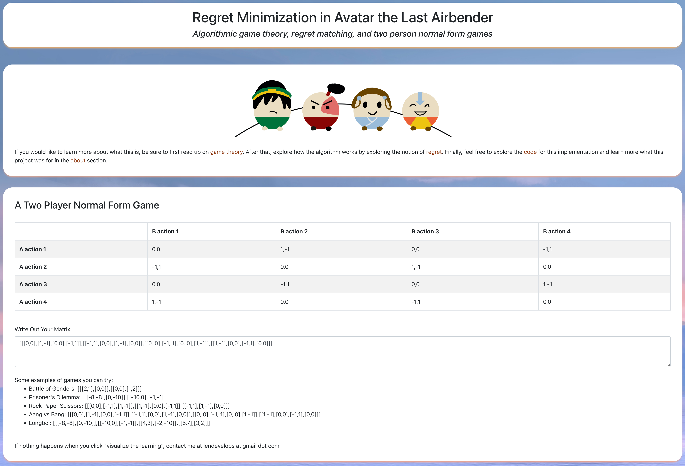

# More Personal Projects

Here is a more extensive directory of personal projects and various tools that I've worked on.

| Link To Repo | Description | Preview |
| --- | --- | --- |
| [🤖 MLforALL](https://github.com/mlforall-app/mlforall) | CMU UEA 4th Place Startup that allowed users to create machine learning models with any CSV they uploaded |  |
| [📸 PicTex](https://github.com/lenghuang/picTex) | PyTorch Hackathon submission of an iOS app to convert images into LaTeX files |  |
| [📍 Commute Script](https://github.com/lenghuang/commute) | A python script that could calculate the 9am commute times of any given location in New York for three different offices |  |
| [🌬️ Regret Minimization in Avatar](https://github.com/lenghuang/ATLA-AGT) | Exploring algorithmic game theory through the lens of Avatar the Last Airbender |  |
| [🖼️ CMU Image Share](https://github.com/lenghuang/cmu-imageshare) | Converting an email chain of images to a shared social media platform during COVID for our department |  |
| [🎥Mov2Gif](https://github.com/lenghuang/mov2gif) | Tool I made at StubHub to help with converting files without needing to rely on a third party provider for privacy reasons | _coming soon_ |
