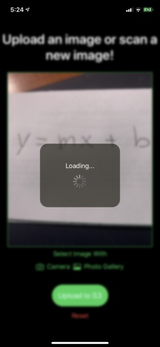

## Hi, I'm `Len` Huang 👋

You might know me from finding the length of a list in `Python`. I'm currently a software engineer in New York City working at StubHub. In the past, I was a Computer Science student at Carnegie Mellon University in Pittsburgh, PA.

## Side Projects

[Here's a more extensive list of the little things I've worked on throughout the years, hopefully you find them interesting!](https://github.com/lenghuang/lenghuang/MoreProjects)

Below are two I'd like to highlight.

| Preview | Description |
| --- | --- |
|  | In the summer of COVID-19, a few friends and I got together and made a startup which got **4th Place in the UEA I-Fund Pitch Competition**. We worked together in a team of several developers, designers, and analysts to create a social platform that allows you to upload a dataset and immediately generate machine learning models from it which you can interact with directly on our platform. I led our team meetings, laid out the architecture with React and Firebase, and connected our backend to sci-kit learn. [Repo](https://github.com/mlforall-app/mlforall) - [LinkTree](https://linktr.ee/mlforall)|
|  | As part of the **PyTorch Hackathon**, we created an iOS app that scans an image of handwritten text and generates a LaTeX file for it. As college students who often typeset assignments in LaTeX, this was our attempt at leveraging computer vision to do it for us. I laid out the foundation for the Convolutional Neural Net used in our model, the dataloaders, and the deployment of our model into an iOS App that I also created with SwiftUI. [Repo](https://github.com/lenghuang/picTex) - [DevPost](https://devpost.com/software/pictex) |